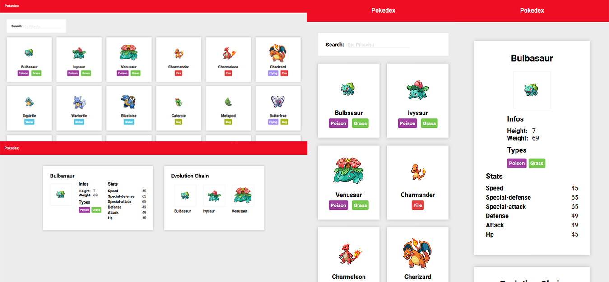

## Pokedex

## Sobre o projeto

O intuíto deste projeto é utilizar o react para criar uma pokedex com dados obtidos da pokeapi.

### Funcionalidades

* Obtenção de dados dos 151 pokémons iniciais

### Desenvolvido utilizando

* [React](https://pt-br.reactjs.org/) - Single page application
* [Axios](https://github.com/axios/axios) - Comunicação com a API
* [React Router](https://reacttraining.com/react-router/web/guides/quick-start) - Controle de rotas
